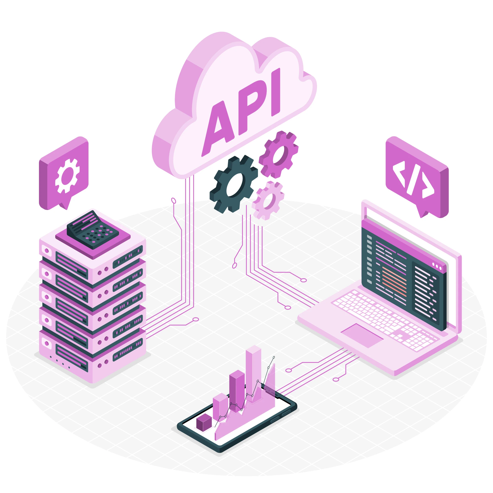

# Sobre

## Seção: `Intro ao MongoDB`

- lore

#

  
  
  

>*Imagens da documentação swagger*
#
## Projeto: `Mongodb Commerce`

- lore

# Tecnologias e ferramentas usadas 🛠

# Desafios

- lore

# Conclusão

- lore

  

    <strong>
      :newspaper_roll: Requisitos solicitados durante o desenvolvimento do projeto
    </strong>
  

 
  ### Requisitos
  *Nome* | *Avaliação*
  --- | :---:
  1 - lore | :heavy_check_mark:

  

    <strong>
      :memo: Todo list
    </strong>
  

  - [x] - ~~Criar aplicação com base nos requisitos da trybe.~~ 

#

  

